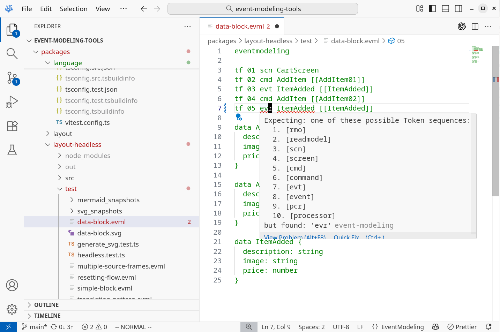
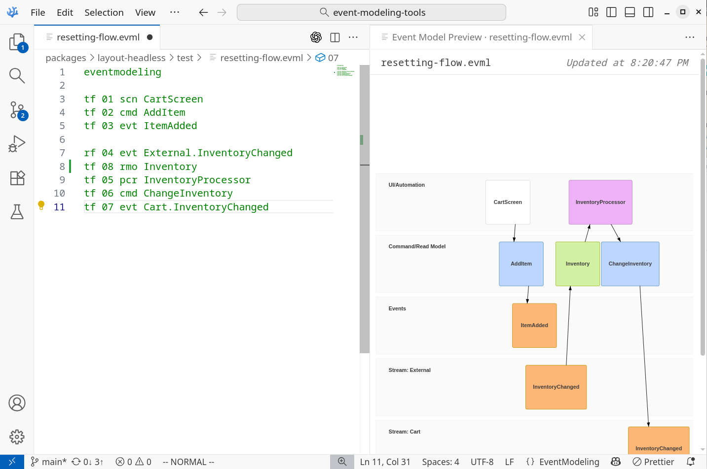
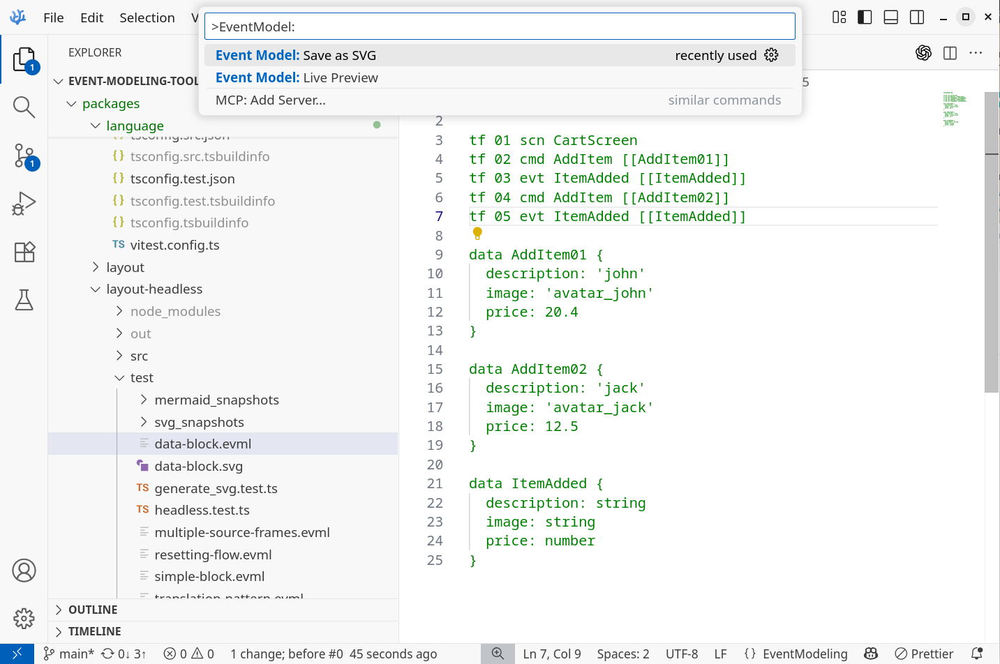

# Event Modeling VS Code Extension

The Extension allows you to view and edit Event Models represented as text DSL. It handles `.evml` files with a built-in language parser and validator giving you direct feedback and auto-complete.

Visit [Event Modeling](https://eventmodeling.org/) to know more how to efficiently capture and share software system information flow, user journeys and events from stakeholders to engineers.

Enter Event Modeling [Discord channel](https://discord.com/channels/1139074016448098375/1139074016448098378) to ask more questions.

## Features

### Language Editor

Write Event Model diagram with ease using the DSL. Capture the main system information flow quickly and efficiently thanks to the text language stored in `.evml` file.

Visit the [DSL Language](https://github.com/lgazo/event-modeling-tools/tree/main/packages/language) to know more.

### Live Preview

Renders Event Model text definition in a parallel tab. 

Activate command bar and search for `Event Model: Live Preview`.

### Save

Save the diagram as SVG.

Activate command bar and search for `Event Model: Save as SVG`.

